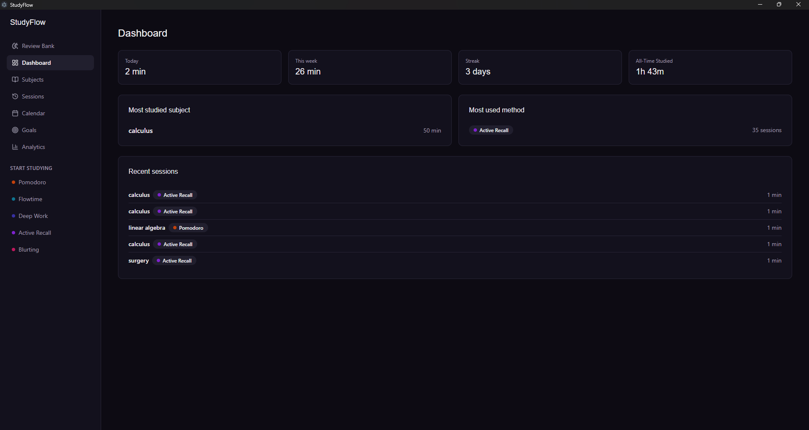
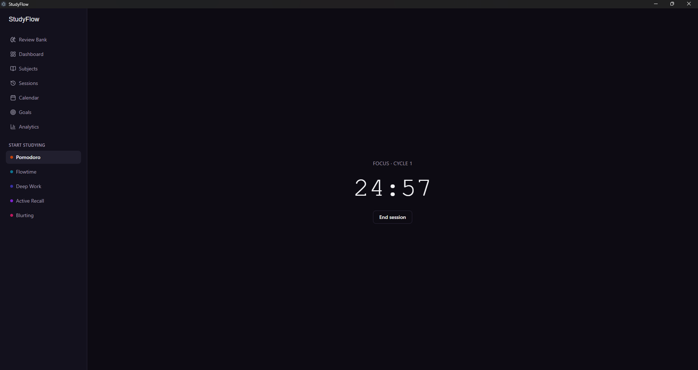
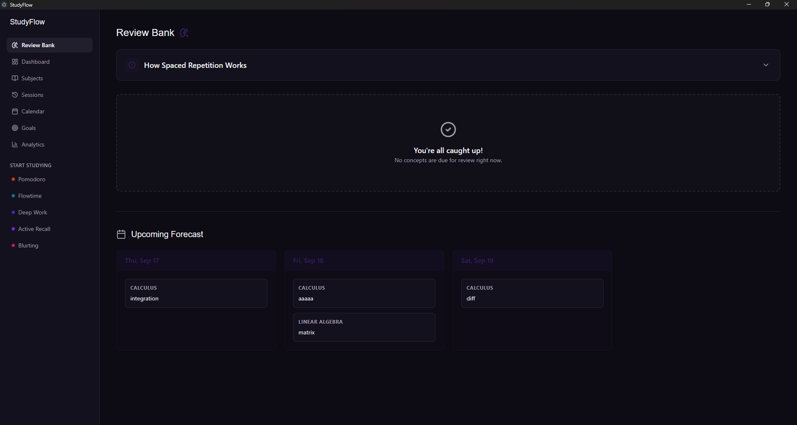
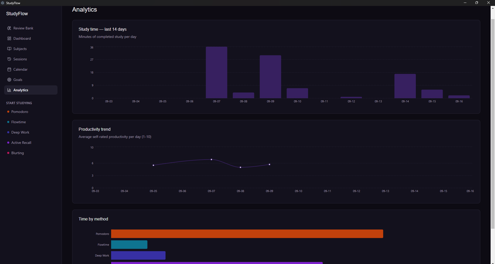

<div align="center">
  
</div>

# 🧠 StudyFlow

> A deeply focused, local-first study environment built for serious learners.

**StudyFlow** is a completely free, offline desktop application designed to help you master complex subjects. I built this because I wanted a study tool that actually respected my focus—and my data. No expensive subscriptions, no cloud syncing delays, and no mandatory accounts. Just a lightning-fast, local environment to get deep work done.

It combines proven study methodologies (Pomodoro, Flowtime, Active Recall) with a built-in Spaced Repetition System (SRS) and data-driven productivity tracking.

---

## 📸 See It In Action

### The Dashboard
*Your command center. See your active streaks, daily goals, and upcoming reviews at a glance.*


### Active Study Sessions
*Where the deep work happens. Track your time seamlessly using Pomodoro, Deep Work, or Flowtime.*


### Spaced Repetition (SRS)
*Never forget a concept. Save weak points during your sessions and lock them into long-term memory with Anki-style daily reviews.*


### Analytics & Calendar
*Understand your habits. Track your productivity trends, session durations, and study methods over time.*


---

## ✨ Why Use StudyFlow?

- **Work How You Want:** Swap seamlessly between Pomodoro, Flowtime, Deep Work, Active Recall, Feynman, and Blurting depending on the task.
- **Retain What You Learn:** The built-in SRS algorithm ensures you review difficult concepts exactly when you are about to forget them.
- **Measure Your Growth:** Rich, interactive charts help you visualize your study time, self-rated productivity, and interruption patterns.
- **Own Your Data:** Everything is stored locally on your machine using a high-performance SQLite database. It works perfectly offline and your data never leaves your computer.

---

## 🛠️ Under the Hood

Built with a focus on performance, modern UI, and maintainability:

- **Frontend:** React 18, React Router, Tailwind CSS, shadcn/ui, Recharts
- **Backend/Desktop:** Electron, Node.js
- **Database:** SQLite (optimized with `better-sqlite3` and WAL mode)
- **Build Tooling:** Vite, Electron-Builder, GitHub Actions

---

## 🚀 Get Started (Free Download)

StudyFlow is a passion project and completely free forever. Because I don't charge for the app, I haven't purchased expensive corporate code-signing certificates, meaning the Windows installer ships unsigned.

1. Head over to the [Releases](#) page and download the latest `.exe` file.
2. Run the installer. 
3. *Note: Windows SmartScreen will likely show a blue "Windows protected your PC" warning. Simply click **More info → Run anyway**. This is a standard, one-time warning for unsigned open-source software.*

---

## 💻 For Developers: Building Locally

Want to tinker with the code or contribute? You're more than welcome. 

*Note: Because `better-sqlite3` requires native C++ bindings, building the Windows installer locally must be done on a Windows machine.*

### Quick Setup
```bash
# Clone the repository
git clone https://github.com/youssefhany2000/studyflow.git
cd studyflow

# Install dependencies (This automatically rebuilds SQLite for Electron's ABI)
npm install

# Start the local development server
npm run dev

## 👤 Author

Developed by **[Youssef Hany]**
- GitHub: [@youssefhany2000](https://github.com/youssefhany2000)
- LinkedIn: [Youssef Hany](https://www.linkedin.com/in/youssef-hany-91a1a1340/)